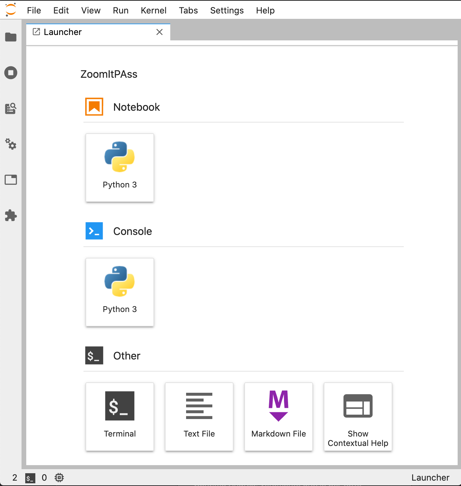
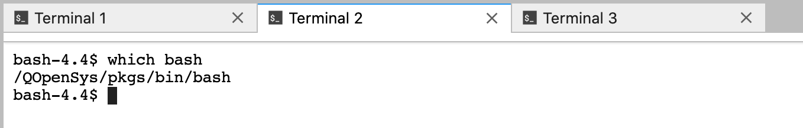
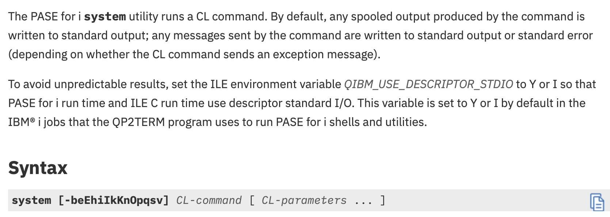

# FORMAZIONE: JupyterLab Intro
*Appunti per il gruppo di studio IPASS sul Machine Learning*

Traccia per la sessione introduttiva a **JupyterLab**

### Premessa

Innanzi tutto esitono già tutorial sull'uso di JupyterLab (ad esempio [Jupyter Lab Tutorial](https://www.youtube.com/watch?v=7wfPqAyYADY)) quindi lo scopo di questo documento è esclusivamente accompagnare il Webinar che verrà programmato da **FAQ400** a breve.

Alcuni cenni *storici* saranno utili e possono trovare un approfondimento in questo saggio introduttivo: [Introduction to Jupyter Notebooks](https://programminghistorian.org/en/lessons/jupyter-notebooks). 

### Interfaccia grafica

**JupyterLab** costituisce la ultima generazione nella evoluzione del **Progetto Jupyter**. Offre i componenti base dello *Jupyter Notebook* classico (notebook, terminale, editor di testi, browser dei documenti, eccetera) in una interfaccia nuova, potente e flessibile.

I tradizionali progetti Jupyter Notebook sono ospitati come oggetti speciali al pari di altri oggetti speciali: la lista dei quali è in continua espansione grazie alla architettura aperta e al contributo di terze parti.

Di fatto si tratta di un IDE per web. 



Ne studiamo prima gli aspetti standard e poi le possibilità di integrazione offerte verso il mondo IBM i.

## Utilizzo standard

SESSIONE INTERATTIVA

[Jupyter Lab on-air](http://gesis400:14143/lab?)

È interessante osservare come la navigazione all'interno dei Notebook vada a braccetto con l'uso preferenziale della tastiera: la **keyboard** torna ad essere la via preferenziale per il conseguuimento della produttività.

Vediamo innanzitutto dove reperire in autonomia informazioni sull'uso dei comandi. Sulla sinistra troviamo una lista di icone (sidebar verticale). Un click su una ciascuna di esse apre una sezione diversa. Un successivo click produce la contrazione della espansione originata all'apertura.
Molto banalmente questo conduce al aumentare l'area utile per visualizzare la pagina coi lavori aperti.

Abbiamo così:

* un browser del percorso dell'IFS a cui l'avvio del servizio è stato ancorato
* un monitor dello stato dei sotto-lavori attivati (terminali, notebook)
* un  


## Utilizzo specifico per IBM i 


Potrà sembrare banale ma la prima cosa che appare ovvia a chiunque si sia confrontato con il mondo Open Source in ambito IBM i è che il **Terminal** offerto da JupyterLab è *eccezionale*. Risolve molte complessità all'utente finale supportando Unicode, le *Unix* pipe, il tunneling via WebSocket. 

La impossibilità di supportare (ad oggi) **Jupyter Hub** frena gli entusiasmi per una adozione più estesa, ma per chi sviluppa è sicuramente una manna.

Partiamo quindi da qui.

Il panel standard con cui si avvia Jupyter Lab è il **Launcher**. In Inglese, *to launch* significa *avviare* quindi da questo pannello si avviano i diversi programmi che compongono l'IDE di Jupyter Lab.

Icone giganti rappresentano i diversi programmi: queste sono organizzate in tre sezioni/raggruppamenti:

* Notebook
* Console
* Other

È nella terza sezione che troviamo **Terminal**.


Ad ogni pressione del bottone viene avviata una nuova sessione di terminale che utilizzerà un panel dedicato. Avremo così Terminal 1, Terminal 2, e così via. Uno solo dei panel riceverà l'input della tastiera e sarà quello la cui etichetta non è grigia.  



Opportunamente configurato il terminale deve utilizzare la **bash** shell resa disponibile da IBM via yum nel percorso `/QOpenSys/pkgs`.
Importanti per una installazione su server localizzato in **Italia** i seguenti due parametri di ambiente: `QIBM_PASE_CCSID`  e `PASE_LANG`.
Possiamo visualizzarne il valore corrente con i seguenti comandi *echo*:

```
bash-4.4$ echo $QIBM_PASE_CCSID
1208
bash-4.4$ echo $PASE_LANG
IT_IT
```

### system 

Quando necessario ricorriamo alla [documentazione ufficiale](https://www.ibm.com/support/knowledgecenter/ssw_ibm_i_74/rzalf/rzalfpasesystem.htm) relativa alla utilità in oggetto.



```
bash-4.4$ system -h
Utilizzo: system [-beEhiIkKnOpqsv] command
```

Esempio di utilizzo:

```
system 'DSPMSGD RANGE(CPF0001 CPF0099)' | grep -1 'Messaggio . . . :'
```