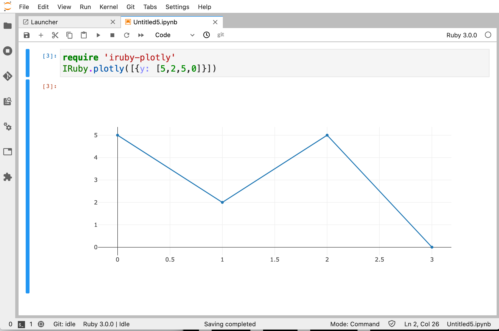
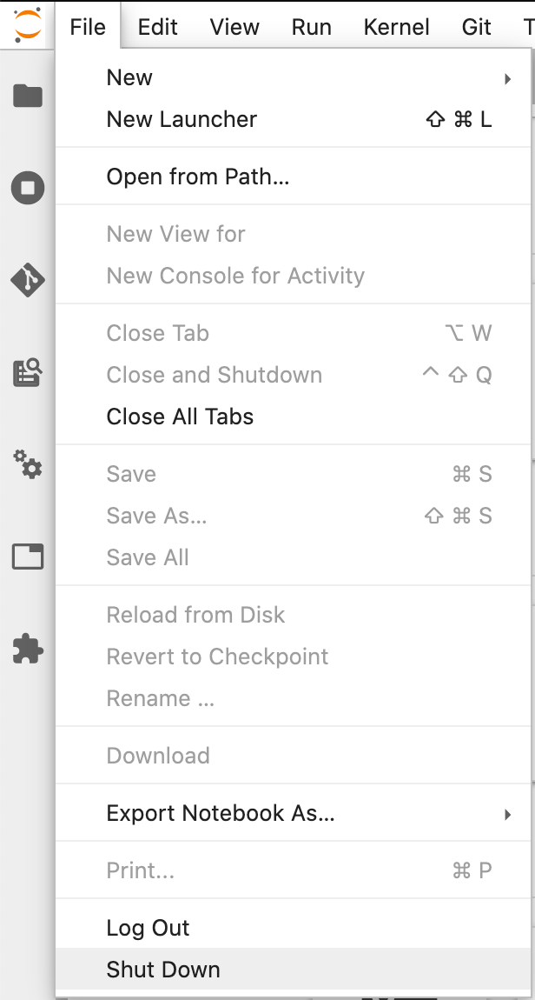
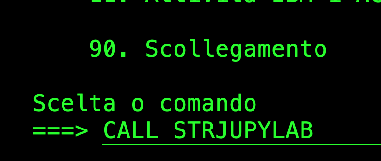
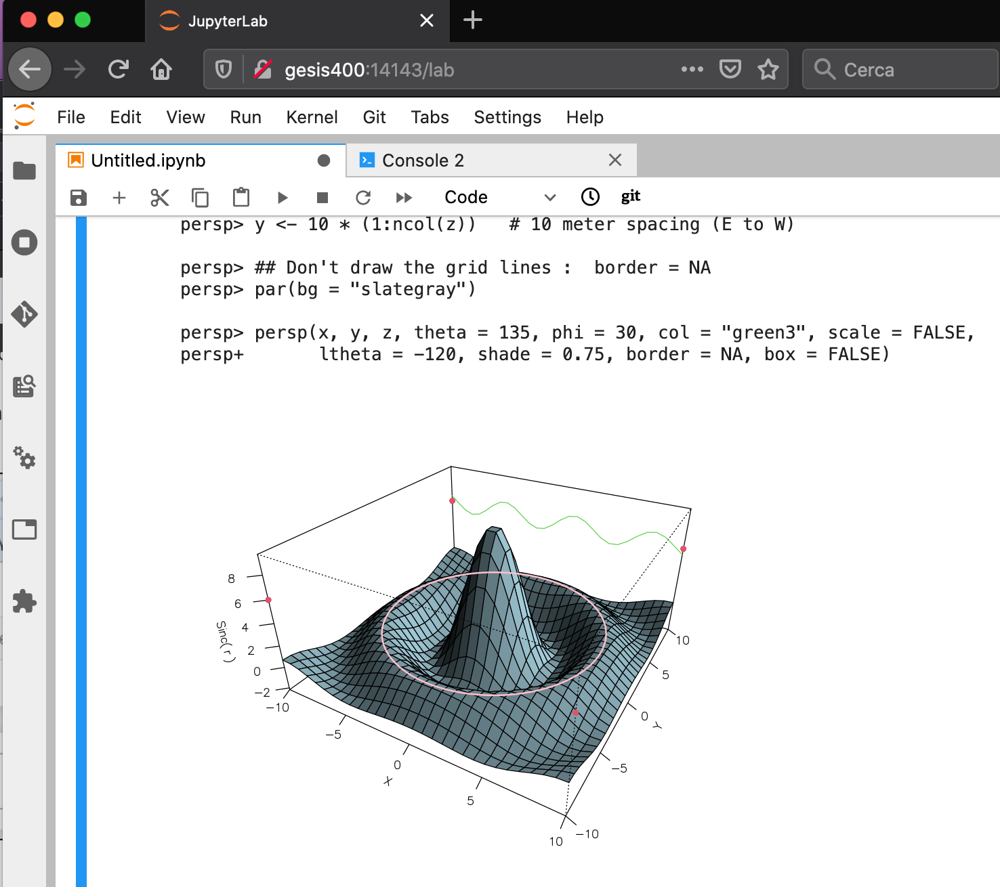

# LEAMACHINE
Appunti per il gruppo di studio sul Machine Learning

## GRUPPO DI STUDIO
L'idea di un primo incontro per lanciare un gruppo di studio sul Machine Learning risale a Settembre 2019.
L'incontro ebbe luogo a Pesaro il 19 Ottobre 2019 sotto il titolo di:

**Machine Learning tramite IBM i**

L'obiettivo dello studio venne descritto nel seguente modo:

*a seguito dei più recenti rilasci di Python (e R) per IBM i sembra aprirsi la strada all'uso diretto (in ambito PASE) di strumenti di machine learning: vorremmo condividere insieme lo studio di questa tematica e valutare la possibilità di strutturare un metodo di lavoro che possa servire agli associati per proporsi sul mercato con competenze nuove.*

Inizialmente focalizzato sulla creazione di oggetti noti come **Jupyter Notebook**, si è successivamente specializzato sulla adozione di 
**JupyterLab** quale interfaccia web standard per la condivisione di esperienze all'interno del gruppo.
Grazie alla cortesia di un membro della associazione ITPASS, i componenti del gruppo di lavoro hanno accesso ad un server IBM i su Internet che viene mantenuto aggiornato in termini di pacchetti Python ed R essenziali allo scopo.

## Integriamo anche il linguaggio Ruby

Mediante la libreria **CZMQ** è stato possibile integrare anche la versione preliminare dell'interprete **Ruby 3.0.0**
*preview1*:

 

## Introduciamo anche il linguaggio R

Abbiamo iniziato con la semplice installazione della versione di **R** disponibile per la comoda installazione via **yum**.
La versione di **R** che IBM rende disponibile per PASE è la **3.5.1**.
Abbiamo acquisito le conoscenze necessarie per realizzare una *build* di una versione molto recente (**4.0.3**) che è ora in grado di offrici le straordinarie possibilità di elaborazione.

### Aggiunta supporto per R (per singolo utente) di Jupyter Lab

Per avere a disposizione l'accesso grafico al supporto del linguaggio **R** procedete nel seguente modo.

Dalla vostra utenza Jupyter Lab selezionate la funzione **Terminal**:


 
Dall'interno della sessione che viene ad aprirsi invocate la versione per linea comando dell'interprete **R**:

```
bash-5.0$ R

R version 4.0.3 (2020-10-10) -- "Bunny-Wunnies Freak Out"
Copyright (C) 2020 The R Foundation for Statistical Computing
Platform: powerpc-ibm-aix6 (64-bit)

R is free software and comes with ABSOLUTELY NO WARRANTY.
You are welcome to redistribute it under certain conditions.
Type 'license()' or 'licence()' for distribution details.

R is a collaborative project with many contributors.
Type 'contributors()' for more information and
'citation()' on how to cite R or R packages in publications.

Type 'demo()' for some demos, 'help()' for on-line help, or
'help.start()' for an HTML browser interface to help.
Type 'q()' to quit R.

[Previously saved workspace restored]

> 
``` 
 
Sulla linea comandi R invocate la funzione `IRkernel::installspec()`, al termine della quale chiudete con la chiamata `q()`.

A questo punto effettuate il completo **Shut Down** di Jupyter Lab:



Per farlo riavviare, una volta collegati con l'emulatore 5250, invocate `CALL STRJUPYLAB` dalla linea comando:




  


## Introduciamo anche l'utilità **plotly** disponibile sia in Python che R

[In Python](FORMAZIONE/PlotlyExample.ipynb)

### Accesso al DB2 da R

Nell'articolo di *ITJungle* dedicato all'introduzione di R in ambito IBM i PASE, esiste la seguente sezione:

*"IBM i shops will be able to use R to access data residing on Db2 for i using **RODBC**, a special version of the ODBC driver that was created especially for R. They can also use the newly delivered ODBC driver, IBM says."*

Non viene chiaramente spiegato ma la installazione necessaria sottostante è quella di due diversi pacchetti in ambito CRAN.

* [RODBC](https://cran.r-project.org/web/packages/RODBC/RODBC.pdf) 
* [odbc](https://cran.r-project.org/web/packages/odbc/odbc.pdf)

Sperimenteremo le due modalità di accesso.

Utile riferimento per il nostro tema è [Databases using R](https://db.rstudio.com)

### Approfondimenti su Jupyter

[Messaging e ZeroMQ](https://jupyter-client.readthedocs.io/en/stable/messaging.html)

## FREQUENZA INCONTRI DI APPROFONDIMENTO DEL GRUPPO DI STUDIO

<br/>Gli incontri del gruppo di studio *ITPASS* si svolgono periodicamente ogni due settimana circa
<br/>Vengono condivise le conoscenze acquisite sul progetto ed approfondite anche differenti tematiche della piattaforma IBM i

## INCONTRI DI INIZIO PROGETTO

* **Italia, 27 Agosto 2020** <br/>Nuovo incontro (virtuale) del gruppo di studio *ITPASS* sul Machine Learning
<br/>*Prevista la presenza di*: Andrea R., Andrea V., Riccardo P., Roberto De Pedrini.
<br/>Predisposizione argomenti per il Webinar dell'8 Settembre che sarà realizzato a tre voci.
* **Italia, 7 Maggio 2020** <br/>Quarto incontro (virtuale) del gruppo di studio *ITPASS* sul Machine Learning
<br/>*Prevista la presenza di*: Andrea R., Andrea V., Claudio G., Riccardo P..
<br/>Approfondimento su tematiche per l'utilizzo di **JupyterLab su IBM i**, installazione e verifica corretto funzionamento
* **Italia, 30 Aprile 2020** <br/>Terzo incontro (virtuale) del gruppo di studio *ITPASS* sul Machine Learning
<br/>*Prevista la presenza di*: Andrea R., Andrea V., Claudio G., Enzo dB., Federico U., Riccardo P..
<br/>Spiegazione per l'utilizzo di **JupyterLab su IBM i** sul server Gesis messo a dispozizione da Enzo dB. 
per le attività associative.
* **Italia, 23 Aprile 2020** <br/>Secondo incontro (virtuale) del gruppo di studio *ITPASS* sul Machine Learning
<br/>*Presenti*: Andrea R., Andrea V., Claudio G., Riccardo P.
<br/>Giro di presentazioni, un poco di storia, idee, aspettative, disponibilità
<br/>Spiegazione dell'uso di **GitHub** per la collaborazione all'interno di ITPASS
* **Pesaro, 19 Ottobre 2019** <br/>Primo incontro all'interno del *Workshop ITPASS*

## UTENZE GitHub

* AndreaRibuoli
* andreava78-2020
* riccardopasqualetti
* CGaiardi

## PRESENTAZIONI

*  **8 Settembre 2020** *ONLiNE DAYS FAQ400* **Python e JupyterLab su IBM i**: Python and AI per IBM i
* **16 Aprile 2020** *Webinar FAQ400* **Jupyter Lab su IBM i**: Python and AI per IBM i
* **21 Novembre 2019, Milano** *Python and Jupyter Notebook running in PASE*

## LINK INTERESSANTI

* [Cheat Sheet per Python](https://github.com/ehmatthes/pcc/blob/master/cheat_sheets/beginners_python_cheat_sheet_pcc_all.pdf) Utile segnalazione di Roberto G.
* [Cheat Sheet per R](https://rstudio.com/wp-content/uploads/2016/10/r-cheat-sheet-3.pdf) Sempre nell'ottica di aiutare la nostra memoria!
* [Extending Jupyter Lab](https://jupyterlab.readthedocs.io/en/stable/developer/extension_dev.html)
* [Working with Jupyter Notebook and JupyterHub on IBM Power Systems
](https://developer.ibm.com/technologies/systems/tutorials/jupyter-notebook-jupyterhub-power-systems/) Tutorial per l'architettura **ppc64le** con suggerimenti interessanti per installare kernel per il linguaggio **C** e per lo sviluppo di di script **bash**.
* [Integrating SQL](https://www.datacamp.com/community/tutorials/sql-interface-within-jupyterlab) Il titpolo dell'articolo è più generico ma in questo nostro riferimento vogliamo valorizzare il focus sull'accesso assistito al linguaggio **SQL** nell'ambito *Jupyter Lab*.
* [Jupyter Lab Tutorial](https://www.youtube.com/watch?v=7wfPqAyYADY) sull'uso dei comandi da tastiera
* [Introduction to Jupyter Notebooks](https://programminghistorian.org/en/lessons/jupyter-notebooks). Articolo introduttivo a Jupyter Notebook con un buon inquadramento storico. Autori: *Quinn Dombrowski*, *Tassie Gniady* e *David Kloster*
* [Elements of AI](https://www.elementsofai.com/) A free online introduction to artificial intelligence for non-experts
* [The Data Science Venn Diagram](http://drewconway.com/zia/2013/3/26/the-data-science-venn-diagram) utile schematizzazione per capire il posizionamento relativo delle competenze che concorrono alla definizione di **data science**.
* [How to Start With Machine Learning on IBM i](https://ibmsystemsmag.com/Power-Systems/11/2019/How-to-Start-ml-on-IBM-i) è il primo articolo di *Gan Zhang*, *Yong Qing Lu* e *Li Hua Zhao* che sono incaricati del tema Machine Learning su IBM i. E' stato pubblicato il 4 Novembre 2019.
* [machinelearning su IBM i](https://github.com/IBM/ibmi-oss-examples/tree/master/machinelearning) sotto cartella GitHub del repository dedicato agli esempi di Open Source per IBM i.
* [IBM i Gets An Influx Of Machine Learning Tooling](https://www.itjungle.com/2018/07/25/ibm-i-gets-an-influx-of-machine-learning-tooling/) è un editoriale pubblicato il 25 Luglio 2018 da *Alex Woodie* su *IT Jungle* in cui ci sono stralci di una intervista a *Jesse Gorzinski* (erroneamente indicato lungo tutto l'articolo come G**ro**zinski) in cui il risvolto più interessante è la menzione al primo impatto del rilascio in ambiente IBM i di Python (2015 all'interno del 5733-OPS). Alcuni clienti provarono subito ad installare i pacchetti Python dedicati al machine learning (non a caso il Machine Learning sembra essere il motivo propulsore del successo di Python degli ultimi anni) e gli sviluppatori IBM scoprirono che nessuno di essi (Numpy, Pandas, SciPy, ecc) riusciva a funzionare, neppure lontanamente.
* [Installing and configuring Python machine learning packages on IBM AIX](https://developer.ibm.com/tutorials/machine-learning-with-python-on-aix/) tutorial per AIX che può essere adottato come traccia per realizzare un percorso di installazione simile su IBM i (autori: *Sanket Rathi - Phani Kumar Ayyagari*). Viene descritta l'installazione di **Jupyter Notebook** che è lo strumento adottato nel testo *Machine Learning For Dummies*. 
* [September 24th](http://ibmsystemsmag.com/Power-Systems/8/2019/RPMs-and-YUM-on-IBM-i-7-1) articolo di *Kevin Adler* (e *Jesse Gorzinski*) che spiega perchè gli RPM dell'Open Source su IBM i verranno allineati tutti alla versione 7.2.
* [IBM Q](http://ibmsystemsmag.com/Power-Systems/09/2019/get-started-with-IBM-q) articolo di *Jesse Gorzinski* da cui si evince che molte novità IBM passano ormai attraverso l'ambiente PASE.
* [R Comes To i](https://www.itjungle.com/2019/05/01/r-comes-to-i/) è un editoriale pubblicato il 1° Maggio 2019 da *Alex Woodie* su *IT Jungle* in merito alla prima introduzione del linguaggio **R** su IBM i (sempre attraverso l'ambiente PASE)
* [Dispense del Corso sul Machine Learning del Prof. Davide Maltoni](http://bias.csr.unibo.it/maltoni/ml/) dell'Università di Bologna -segnalate da Federico-
* [MATLAB per il Machine Learning](https://it.mathworks.com/solutions/machine-learning.html) materiale -segnalato da Enzo- focalizzato su MATLAB e quindi relativo ad un ambiente integrato ad un prodotto SW non Open Source: tra i punti di forza si enfatizza la *esecuzione più rapida rispetto all’open source sulla maggior parte dei calcoli statistici e di machine learning*
* [Analisi Comportamentale](https://www.bitmat.it/blog/news/89079/machine-learning-e-analisi-comportamentale), link suggerito da Enzo 
* [From gnuplot to matplotlib](https://ds9a.nl/articles/posts/from-gnuplot-to-matplotlib-pandas/)
* [seaborn](https://seaborn.pydata.org/index.html)
* [Python Data Science Handbook](https://github.com/jakevdp/PythonDataScienceHandbook) la intera pubblicazione è disponibile in formato Jupyter Notebook.
* [Corso completo di Data Science e Machine Learning con Python](https://www.udemy.com/course/data-science-con-python/) Corso completo su piattaforma Udemy realizzato da Valentina Porcu che è una professionista del settore. Il corso è sviluppato su circa 17,5 ore totali di videolezioni e affronta in modo dettagliato tematiche di Data Science e Python.


## TESTI INTERESSANTI
Elenco qui di seguito alcuni testi che nel corso degli anni ho acquistato per approfondire l'argomento: li elenco procedendo dal generale al particolare.

* **Machine Learning con R** *Brett Lantz* Traduzione della terza edizione del corrispondente testo in lingua inglese.
* **Deep Learning con Python** *François Chollet* testo -recentemente tradotto- introduttivo alle reti neurali e all'utilizzo di Keras/TensorFlow.
* **L'analisi dei Big Data con Python** *Ivan Marin - Ankit Shukla - Sarang VK* Scritto da specialisti del campo. Focalizzato su Python e (prevalentemente) strumenti Open Source.
* **A tu per tu col Machine Learning. L'incredibile viaggio di un developer nel favoloso mondo della Data Science** *Alessandro Cucci* <br/> Testo molto interessante segnalato da Claudio per la prospettiva di gestione progettuale della introduzione pratica del Machine Learning.
* **INTELLIGENZA ARTIFICIALE** *Stuart Russell - Peter Norvig* <br/> Testo generale che abbraccia tutto il campo della Intelligenza Artificiale (il Machine Learning è trattato nel secondo volume)
* **Foundations of Machine Learning** *Mehryar Mohri, Afshin Rostamizadeh, Ameet Talwalkar* <br/> Testo universitario della *MIT Press* per approfondire i riferimenti alla logica e alla matematica su cui il Machine Learning si basa... non sono andato oltre alla introduzione!
* **Big Data Analytics** *Andrea De Mauro* <br/> testo più pratico -pubblicato da APOGEO- che gravita attorno all'uso di **KNIME** come piattaforma analitica per Data Science e Machine Learning con gran parte dei tools offerti gratuitamente con licenza Open Source
* **Machine Learning con Python** *Sebastian Raschka* <br/> è anch'esso un testo pratico -pubblicato da APOGEO nel 2016- che si focalizza su librerie **Python** (utilizza *NumPy*, *SciPy*, *scikit-learn*, *matplotlib* e *pandas*)
* **Data Science con Python** *Dmitry Zinoviev* <br/> è anch'esso un testo pratico focalizzato alla trasformazione di database in dataset utili al data mining, machine learning, e altre branche dell IA -pubblicato da APOGEO nel 2017- che si focalizza su librerie **Python** 
* **Machine Learning For Dummies** *John Mueller - Luca Massaron* <br/>
è un testo più recente (2019) che traduce l'originale inglese del 2016 -*Wiley*- ed è pubblicato in Italia da *Hoepli*. Il vantaggio è che essendo uno dei coautori italiano, il testo è stato completamente rivisitato nella parte pratica per concludere la migrazione da Python2 e Python3 che non era ancora completa nel 2016. Il testo introduce all'uso di **Python** e **R**.
* **Analisi del linguaggio con Python** *Serena Sensini* <br/> è anch'esso un testo recente -pubblicato da APOGEO nel 2019- che si focalizza sul *Natural Language Processing (NLP)* (utilizza librerie Python specializzate come *NLTK*, *spaCy*, *NetworkX*, oltre a quelle già note -Numpy, Pandas, Scikit-learn-)
* **L'Algoritmo Definitivo** *Pedro Domingos* <br/>
pubblicato da Boringhieri tra i *Saggi - Scienze*, presenta le radici culturali che hanno portato alla rivoluzione del *Machine Learning*. Apre con una frase ad effetto: *"Forse non lo sapete, ma il machine learning vi ha circondato"* 

Poiché la idea del gruppo di lavoro ITPASS è volta a valorizzare il porting che IBM ha effettuato di Python ed R in ambito **PASE** ritengo che gli ultimi due testi potranno essere decisamente interessanti. 

Il primo obiettivo di questo repository sarà documentare i passi per installare **Python3** ed **R** in ambito PASE secondo un approccio operativo: il repository potrà essere installato su IBM i automatizzando i passi necessari (il che dovrebbe semplificarci la vita...).

## INSTALLAZIONE

Partiamo dalla ipotesi che abbiate già installato **yum** sul vostro sistema IBM i (gli esempi sono basati su una versione 7.3)

*Le indicazioni sono state rimosse perchè cresciute considerevolmente in termini di complessità ed essendo soggette a troppo frequenti necessità di aggiornamento: saranno oggetto di una parte del prossimo Webinar (8/9/2020)*

<!---
### aggiornamento (update)

Vogliamo procedere all'aggiornamento dei pacchetti installati.
Lanciamo **QSH** e proviamo ad eseguire `yum update`:

```
  $                                                                
> /QOpenSys/pkgs/bin/yum update                                    
  You need to be have *ALLOBJ authority to perform this command.   
  $                                                                
```

E' evidente che è richiesto l'uso di un profilo utente autorizzato. Ripetiamo l'operazione quando siamo collegati con un profilo utente idoneo.

Se non risultano conflitti si può procedere con l'aggiornamento:

```
  $                                                                             
> /QOpenSys/pkgs/bin/yum update                                                 
  Impostazione processo di aggiornamento                                        
  Risoluzione dipendenze                                                        
  - - > Esecuzione del controllo di transazione                                   
  - - - > Package bash.ppc64 0:4.4-0 will be aggiornato                            
  - - - > Package bash.ppc64 0:4.4-1 will be an update                             
  . . .
  - - - > Package libutil2.ppc64 0:0.6.1-0 will be installato                          
  - - - > Package python2-iniparse.noarch 0:0.4-1 will be installato                   
  - - > Risoluzione delle dipendenze completata                                       
                                                                                    
  Dipendenze risolte                                                                
                                                                                    
  ================================================================================  
   Pacchetto                Arch           Versione             Repository   Dim.   
  ================================================================================  
  Aggiornamento:                                                                    
   bash                     ppc64          4.4-1                ibm         2.1 M   
   libgcc_s1                ppc64          6.3.0-24             ibm         197 k   
   liblzma5                 ppc64          5.2.3-3              ibm         265 k   
   . . .
   python2-rpm              ppc64          4.13.0.1-17          ibm         275 k    
   rpm                      ppc64          4.13.0.1-17          ibm         2.2 M    
   yum                      noarch         3.4.3-17             ibm         1.2 M    
   zlib-devel               ppc64          1.2.11-2             ibm          38 k    
  Installazioni per dipendenze:                                                      
   grep-gnu                 ppc64          3.0-0                ibm         515 k    
   libutil2                 ppc64          0.6.1-0              ibm          16 k    
   python2-iniparse         noarch         0.4-1                ibm          28 k    
                                                                                     
  Riepilogo della transazione                                                        
  ================================================================================   
  Install       3 Packages                                                           
  Upgrade      12 Packages                                                           
  Dimensione totale del download: 55 M                                        
  Procedere [s/N]:                                                            
> s                                                                           
  Download dei pacchetti:                                                     
  (1/15): bash-4.4-1.ibmi7.1.ppc64.rpm                        | 2.1 MB  00:01 
  (2/15): grep-gnu-3.0-0.ibmi7.1.ppc64.rpm                    | 515 kB  00:00 
  . . . 
  (14/15): yum-3.4.3-17.ibmi7.1.noarch.rpm                    | 1.2 MB  00:00      
  (15/15): zlib-devel-1.2.11-2.ibmi7.1.ppc64.rpm              |  38 kB  00:00      
  -------------------------------------------------------------------------------- 
  Totale                                          1.1 MB/s |  55 MB     00:48      

Running Transaction Check                                                        
Test di transazione in corso                                                     
Test di transazione eseguito con successo                                        
Transazione in corso                                                             
  Aggiornamento     : libgcc_s1-6.3.0-24.ppc64                             1/27  
  Aggiornamento     : libz1-1.2.11-2.ppc64                                 2/27  
  . . .
  Aggiornamento     : zlib-devel-1.2.11-2.ppc64                           14/27
  Aggiornamento     : libutil1-0.3-99.ppc64                               15/27
  Pulizia           : nodejs10-10.15.3-0.ppc64                            16/27
  Pulizia           : yum-3.4.3-15.noarch                                 17/27
  Pulizia           : python2-rpm-4.13.0.1-13.ppc64                       18/27
  . . . 
  Pulizia           : libtool-2.4.6-3.ppc64                               25/27
  Pulizia           : libgcc_s1-6.3.0-19.ppc64                            26/27   
  Pulizia           : bash-4.4-0.ppc64                                    27/27   
                                                                                  
  Dipendenza installata:                                                            
    grep-gnu.ppc64 0:3.0-0                     libutil2.ppc64 0:0.6.1-0             
    python2-iniparse.noarch 0:0.4-1                                                 
                                                                                  
  Aggiornato:                                                                       
    bash.ppc64 0:4.4-1                       libgcc_s1.ppc64 0:6.3.0-24             
    liblzma5.ppc64 0:5.2.3-3                 libtool.ppc64 0:2.4.6-4                
    libutil1.ppc64 0:0.3-99                  libz1.ppc64 0:1.2.11-2                 
    nodejs10.ppc64 0:10.16.3-1               python2.ppc64 0:2.7.16-1               
    python2-rpm.ppc64 0:4.13.0.1-17          rpm.ppc64 0:4.13.0.1-17                
    yum.noarch 0:3.4.3-17                    zlib-devel.ppc64 0:1.2.11-2            
                                                                                  
  Completo!                                                                         
  $                                                                                 
```

In ogni momento possiamo filtrare l'archivio dei pacchetti PASE installati; ecco due dei pacchetti menzionati in precedenza:

```
  $                                                                   
> /QOpenSys/pkgs/bin/yum list | grep scikit                           
  python3-scikit-learn.ppc64            0.19.1-6                 ibm  
  $                                                                   
> /QOpenSys/pkgs/bin/yum list | grep pandas                           
  python3-pandas.ppc64                  0.22.0-4                 ibm  
  $                                                                   
```

Ora se confrontiamo le versioni utilizzate in uno dei testi citati (vedi *Machine Learning con Python* a pagina 13) potremmo trovare ad esempio pandas 0.15.2: ci accorgiamo subito di come facilmente possano intercorrere cambiamenti che possono crearci qualche difficoltà (almeno agli inizi).

Il comando per installare nuovi pacchetti è `/QOpenSys/pkgs/bin/yum install` seguito dal nome del pacchetto che si vuole installare. Il valore di yum è -principalmente- quello di garantire che le dipendenze che caratterizzano il pacchetto siano rispettate (e quindi installate se mancanti).

Come è noto impostando `export PATH=/QOpenSys/pkgs/bin:$PATH` si può successivamente omettere il percorso ove risiedono i comandi e lanciare direttamente `yum` o `python3`. 

In molti esempi su internet si fa riferimento alla libreria **matplotlib** che ora è disponibile anche su IBM i.                                       
La installazione di *matplotlib* è stata possibile tramite **pip**: il *package installer for Python*. 
I pacchetti per Python possono essere installati nella modalità Python (rispetto all'uso di **yum**).

```
  $                                                                                                                                
> pip3 install matplotlib                                                                                                          
  Requirement already satisfied: matplotlib in /QOpenSys/pkgs/lib/python3.6/site-packages (3.1.1)                                  
  Requirement already satisfied: cycler>=0.10 in /QOpenSys/pkgs/lib/python3.6/site-packages (from matplotlib) (0.10.0)             
  Requirement already satisfied: kiwisolver>=1.0.1 in /QOpenSys/pkgs/lib/python3.6/site-packages (from matplotlib) (1.1.0)         
  Requirement already satisfied: python-dateutil>=2.1 in /QOpenSys/pkgs/lib/python3.6/site-packages (from matplotlib) (2.8.0)      
  Requirement already satisfied: numpy>=1.11 in /QOpenSys/pkgs/lib/python3.6/site-packages (from matplotlib) (1.15.4)              
  Requirement already satisfied: pyparsing!=2.0.4,!=2.1.2,!=2.1.6,>=2.0.1 in /QOpenSys/pkgs/lib/python3.6/site-packages (from matplotlib) (2.4.2)                                                                                                                   
  Requirement already satisfied: six in /QOpenSys/pkgs/lib/python3.6/site-packages (from cycler>=0.10->matplotlib) (1.10.0)        
  Requirement already satisfied: setuptools in /QOpenSys/pkgs/lib/python3.6/site-packages (from kiwisolver>=1.0.1->matplotlib) (36.0.1)                                                                                                                             
  $                                                                                                                                
```
--->

## HANDS ON - LIBRERIE PYTHON SUPPORTATE

Di seguito i pacchetti che utilizziamo e che sono pienamente supportati nell'installazione ITPASS su IBMi per fare test e prove di analisi di dati:

* [scikit-learn](hands_on/scikit-learn.md)
* [pandas](hands_on/pandas.md)
* [numpy](hands_on/numpy.md)
* [matplotlib](hands_on/matplotlib.md)
* [ibm-db](hands_on/ibm-db.md)


## CONFIGURAZIONE gesis400

Per aggiornare la versione dei programmi di utilità per l'avvio di **Jupyter Lab** nelle sessioni individuali: 

`PASERIE/INSTALL GIT_USER(itpassdev) PACKAGEN(LEAMACHINE)`


## CONFIGURAZIONE yum

Sul server a disposizione per ITPASS è stata configurata l'opzione di sicurezza (`sslverify=1`) per cui i download sono
protetti dal protocollo SSL.

È stato poi introdotto un secondo repository in cui sono depositati alcuni dei pacchetti 
pre-compilati a versioni più aggiornate di quelle disponibili sul sito IBM.

```
                        Gestione collegamenti oggetto                   
                                                                        
Indirizzario . . . :   /QOpenSys/etc/yum/repos.d                        
                                                                        
Immettere le opzioni e premere Invio.                                   
  2=Modifica         3=Copia   4=Rimozione   5=Visualizz.   7=Ridenom.  
  8=Attributi vis.   11=Modifica indirizzario corrente ...              
                                                                        
Opz.  Colleg. oggetto       Tipo    Attributo   Testo                   
      andrearibuoli.repo    STMF                                        
      ibm.repo              STMF                                        
```

Esempio di utilizzo per aggiornare la **bash 5.0**

```
  $                                                                                
> yum install bash                                                                 
  Impostazione processo di installazione                                           
  Risoluzione dipendenze                                                           
  --> Esecuzione del controllo di transazione                                      
  ---> Package bash.ppc64 0:4.4-2 will be aggiornato                               
  ---> Package bash.ppc64 0:5.0-0 will be an update                                
  --> Risoluzione delle dipendenze completata                                      
                                                                                   
  Dipendenze risolte                                                               
                                                                                   
  ================================================================================ 
   Pacchetto      Arch            Versione          Repository               Dim.  
  ================================================================================ 
  Aggiornamento:       
   bash           ppc64           5.0-0             andrearibuoli           2.2 M   
                                                                                    
  Riepilogo della transazione                                                       
  ================================================================================  
  Upgrade       1 Package                                                           
                                                                                    
  Dimensione totale del download: 2.2 M                                             
  Procedere [s/N]:                                                                  
> s                                                                                 
  Download dei pacchetti:                                                           
  bash-5.0-0.ibmi7.3.ppc64.rpm                                | 2.2 MB  00:00       
  Running Transaction Check                                                         
  Test di transazione in corso                                                      
  Test di transazione eseguito con successo                                         
  Transazione in corso                                                              
    Aggiornamento     : bash-5.0-0.ppc64                                      1/2   
    Pulizia           : bash-4.4-2.ppc64                                      2/2   
  Aggiornato:          
    bash.ppc64 0:5.0-0 
                      
  Completo!            
  $                                                                                                    
```

## CONFIGURAZIONE Jupyter Lab

Terminati tutti gli utilizzi, può rilevarsi utile reinizializzare l'ambiente jupyter:

```
  $                                                             
> jupyter lab clean                                             
  [LabCleanApp] Cleaning /QOpenSys/pkgs/share/jupyter/lab...    
  [LabCleanApp] Removing staging...                             
  [LabCleanApp] Success!                                        
  $                                                             
> jupyter lab build                                             
  [LabBuildApp] JupyterLab 2.2.8                                
  [LabBuildApp] Building in /QOpenSys/pkgs/share/jupyter/lab    
  [LabBuildApp] Building jupyterlab assets (build:prod:minimize)
  \                                                             
```

Sperabilmente, dopo un lungo alternarsi di `/`,`-`, `\` e `|`, dovrebbe risultare ricomposto l'ambiente per **Jupyter Lab**.

Occorre solo avere *tanta* fiducia!  

